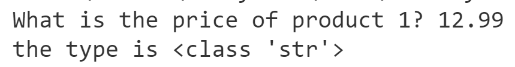

# Chapter 3: Lab 2 Practice with Numbers

## Objectives
* Receive input as string
* Convert string to float
* Perform calculations
* compare values 
* print results

## Overview

* Calculate the price per ounce for two products and display which is cheaper.  
* if you get done before others attempt the bonus
  
## Steps

1. In your MyPythonCourse project, in the Ch03 directory create a new file called which_is_cheaper.py
   
2. Inside this new file, add the following line which uses the input function to read in a string that represents the price of product 1.

    ```python
    product1_price = input("What is the price of product 1? ")
    ```

3. What is the data type of product1_price?

4. Confirm if your thinking is correct by adding this line which prints out the type using print() and type().
    ```python
    print('the type is', type(product1_price))
    ```

   Notice how you can combine the functions calls. First type is returned - then that is passed as an argument to the print function.

   Sometimes you print values to debug your code. It helps to use a string to identify what it is you are trying to print - especially as your code grows. Here we described we are checking the type.

5. Pass the print() function two arguments. First, a string describing what is going to be printed, and second, the value itself.

    ```python
    print('product1_price is:', price1)
    ```

6. We are not done yet, but it can be helpful to run the code to test if there are any errors. Because it uses input() you cannot use the context menu. From VS Code Explorer pane, right-click the file and choose open in Terminal to get the right directory to appear. Then type: 
    ```bat
        py which_is_cheaper.py
    ```

    When prompted, give the value of **12.99**

    You should see your output.

    
    

7. Keep the terminal window open so that you can re-execute the code by hitting the up arrow to repeat the last command.

8. The values from the input() function come in as strings. If you try to perform any calculations, you will get an error. Try this... print(product1_price + 2)

9. In the terminal hit the up arrow and run again. What is the error?

    Now comment out the line causing the error by putting your cursor on that line and hitting CONTROL + /    the forward slash will cause it to be commented out using # 

   
10. Convert this string to a float value using the float() function - and store this as price1.

    ```python
    price1 = float(product1_price)
    ```

11. You can check to see if the given float value can be considered an integer by using the function is_integer().
    ```python
    print('Product 1 is an integer:',price1.is_integer())
    ```

12. Execute the code again. First with 12.99 as the input and next with 12.0


13. Now use input to also ask for the weight of product1 in ounces, convert it to a float before storing it as weight1.

    ```python
    weight1 = float(input("How many ounces is product 1? "))
    ```

14. Ask the same questions and get the data for product2.

    ```python
    price2 = float(input("What is the price of product 2? "))

    weight2 = float(input("How many ounces is product 2? "))
    ```

15. You can print the values and run your code to see that it is still working.
   
16. Now figure out which product is the best value. Calculate the price per ounce for product 1 and product 2.
   
    ```python
    price_per_ounce1 = price1 / weight1
    price_per_ounce2 = price2 / weight2
    print("Price per ounce of product 1:")
    print(price_per_ounce1)
    print("Price per ounce of product 2:")
    print(price_per_ounce2)
    ```

17. Create a message that displays true or false for the statement: "Product 1 is cheaper"

    ```python
    print(price_per_ounce1 < price_per_ounce2)
    ```


18. Create a message that displays true or false for the statement: "Product 2 is cheaper" by changing the logic in the last step.

19. Run your code with the values where product1 is cheaper and again where product2 is cheaper. Do you get the right output?
   
20. Now enter 12 for all of the values. What are the last two booleans that are printed?
   
21. Add another print statement and this time check to see if price1 == price2
   

22. Mark your work as complete. If you get done before others, then move on to the bonus.

## Bonus

### Apply a Discount
1. Offer a 10% discount if buying product1 and product2.
   
   * Print the original sum. 
   * Print the new total after 10% discount  

2. Modify your program to print statements which show the following type of results.
   
   Make sure to import the math module. 

    Use the functions to calculate the values. Refer to the slides as necessary.

    Given 12.99 as input:

   * The truncated value of product1 is 12
   * The rounded value of product1 is 13
   * The floor value is...
   * The ceil value is...
  
1. Write a new program called percent_discount. At the command line you will execute by passing in the original amount and then the percentage to take off. For example - using 
   ```bat
   py percent_discount.py 100 10
   ```

   Would result in this output:

    $100 at 10% discount is $90

    Remember to convert to numerics to do the math, and convert to string to concatenate output.

### Absolute value

1. Absolute value is an important concept for calculus and real analysis, but it also makes sense when we think about everyday situations like distance travelled. For example, if we are trying to get somewhere that is 58 miles away but we travel 93 miles instead, we overshot our original destination. If we want to calculate now how many miles left to travel to get to the intended destination, we’ll end up with a negative number, but we can’t travel negative miles.

Let’s use abs() to solve this problem:

1. Create a file called
destination_miles.py

1. Ask for the distance the destination is from the origin.

    For example, you may end up with miles_from_origin = 58  

1. Ask for the distance the travelled from origin to destination (could be too many)
miles_travelled = 93 

1. Calculate how many miles destination is from current location:
miles_to_go = miles_from_origin - miles_travelled   

1. print(miles_to_go)      

1. run the program and give a higher value for travelled, so result is negative.
   
1. Now print(abs(miles_to_go))to get absolute value to account for negative number