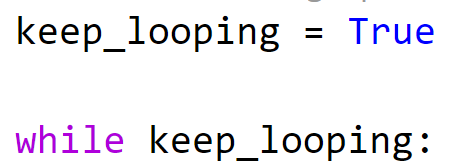
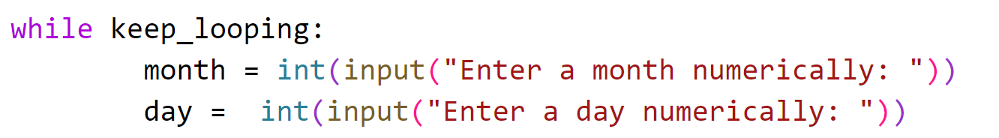
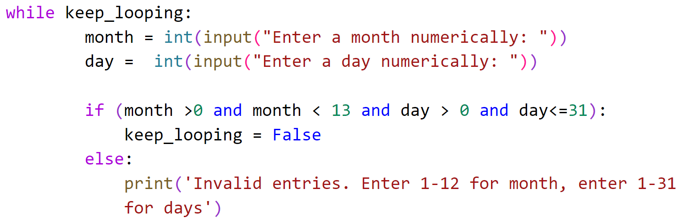
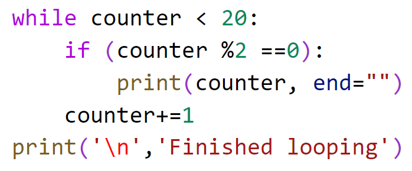
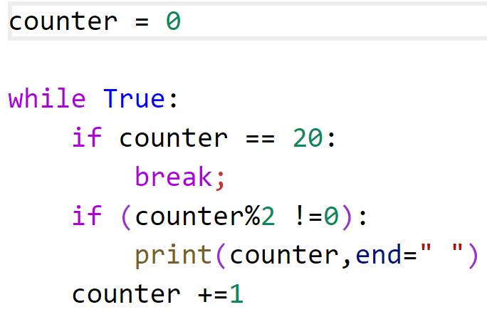
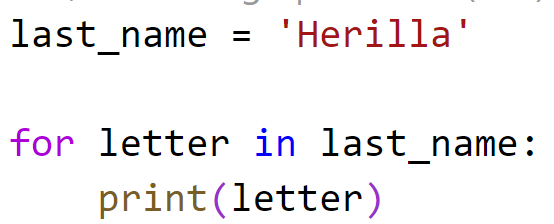
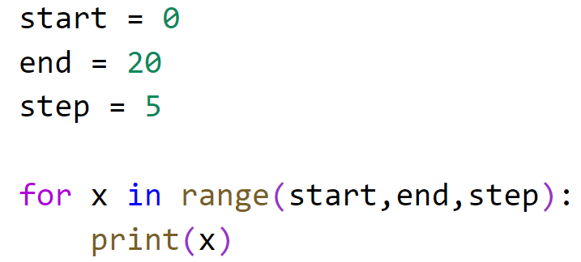

# Chapter 3: Lab 5 Using Loops

## Objectives
* Get used to writing loops in Python
* Use break
* Use for in
* Use range

## Overview

* Write various programs to practice the concepts in this chapter section

## Links to 

[Part 1 - Keep Looping until Valid Input](#part-1---keep-looping-until-valid-input)

[Part 2 - Print Loops to one line](#part-2---print-loops-to-one-line)

[Part 3 - Use break](#part-3---use-break)

[Part 4 - For In](#part-4---for-in)

[Part 5 - Range](#part-5-using-range)

[Bonus](#bonus)

### Part 1 - Keep looping until valid input

1. In your MyPythonCourse project, in the Ch03 directory create a new file called **basic_program.py**
   
2. Inside this new file, create a variable keep_looping and set it to True.

3. Create a while loop that uses the keep_looping variable to know whether to keep looping.

    

4. On the next line, use an indent and in the code block ask the user for a month (string) and a day (number)

    

5. Add code in the block to check if the month value is greater than 0 and less than 13 AND the day is greater than 0 and less than or equal to 32. If it is, set the value of keep_looping to False

    

6. After the loop, print out, You did it!

### Part 2 - Print loops to one line

    The use of screenshots has now been minimized to new information only.
    This is to help you concentrate on the steps themselves. 
    Try to read the statements and perform the work.
    If you need help you can:
        * refer to previous examples with screenshots.
        * scroll down to see screenshot of the completed code 
        * look at the solutions on GitHub
[Link to Solutions on GitHub](https://github.com/JudyLipinski/200Python/tree/master/Labs/Ch03-syntax/5loops/Solutions)

1. In your MyPythonCourse project, in the Ch03 directory create a new file called **print_evens_one_line.py**

2. Create a variable called counter and set it to 0.
   
3. Create a while loop that loops while  counter is less than 20.

4. In the indented code block for the while, do the following:
   * add an if statement checking if the counter is  even. Recall you can use modulus for this, checking if remainder is 0
   * in the indented code block for if, print the counter
   * After the if, but still in the while loop, increment the counter by one

5. After the while loop print "Finished Looping"

6. Run your code, you should see even numbers displayed vertically.
   
7. Create a copy of your while loop, highlight code, control + c, then control  v after the code.
   
8. In this new while loop, modify the print of the counter by adding another argument of end="". Using end tells print to not add a '\n' after each print.

    

9. Run the code. You should now see the evens printing in a line. 

10. Copy/paste the loop again to create another loop to practice with. This time pass in end=" " - note the space. Run again and see your output has spaces between.

### Part 3 - Use break 

1. In your MyPythonCourse project, in the Ch03 directory create a new file called **find_odds.py**

2. In this new file, create a variable called counter and set it to 0.
   
3. Create a while loop but this time set the condition to always be True. This may seem like an infinite loop but there will be a way out.
   
4. In the indented code block for while, use an if statement to check if the counter has reached 20. If so then use the indented block for this with a break statement
   
5. Next, after the if statement, add a check to see if the counter is odd. This is similar to checking for evens, you can use (counter%2 != 0)

6. If the number is odd, then in the indented if code block use a print statement to print the current value of counter. Use end=" " with a space so that output appears on one line.
   
7. After the if code block, but still inside the while loop, add code to increment the counter by 1.

    

### Part 4 - For in

1. In your MyPythonCourse project, in the Ch03 directory create a new file called **for_in.py**

2. In this new file, create a variable called last_name and set it to your last name.
   
3. Use a for in loop to print out the letters in your name on separate lines.

    
    
### Part 5 Using Range

1. In your MyPythonCourse project, in the Ch03 directory create a new file called **count_by_five.py**

2. In this new file, create the variables start, end and step. Set these to 0, 20 and 5 respectively. 
   
3. Use a for in loop, with x as the iterator variable, and using start, end and step as the arguments to range.  
   
4. Inside the for block, print(x)
   
5. Run your code.

    

## Bonus 

### Bonus 1: change find_odds to take input 

1. Create a copy of find_odds.py and call it find_dynamic_odds.py. In this new file, modify the code by asking the user if they wish to set the limit. No input means the default of 4. Use the value in your condition check to break from the loop.
   
### Bonus 2: create a dynamic range program

1. Similar to count by five create a program that asks the user fro the start, the end and the step.
   
2. Then use a while loop that will keep asking for good input until you receive it. Give them a message. 
   
        Do you wish to include:
        
        1. All numbers
        
        2. Evens
        
        3. Odds

3. Write the logic so that the program does what they have requested with 1,2,3. 
    
