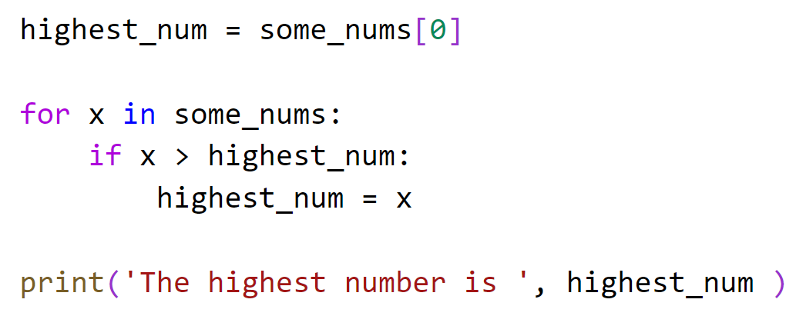

# Chapter 4: Lab 1 Sequences

## Objectives

* Practice using list, tuple, range

## Overview:

You will create and work with different sequence types.

### Part 1: List

1. Create a new folder in your MyPython project folder called Ch04. You can do this by right-clicking on the folder and choosing new folder.

    

2. In your MyPython project folder, in the folder Ch04, create a new file called **num_list.py**. You can do this by right clicking the folder and choosing new file.
   
3. In the file create a list of numbers with 9 items:

    some_nums = [2,6,4,2,22,54,12,8,-1]

4. Print the length of the list using the len(some_nums).

5. Print the sum by using a function called sum.
   
    print('the sum of the list is: ',sum(some_nums))

6. Print the third item by using the index. Your output should be 4.
   
7. Create a for loop which will find the largest number. 
   1. First set a variable highest_num = some_nums[0]
   2. Then loop using for in syntax across all items
   3. check if current item is > highest_num and if so replace the content of highest_num
   4. When done looping, print the highest number

    

8. Now change some_nums so that every other items is the number 11.
   1. You cannot change values while in a for loop that is iterating over the collection.
   2. You can though, create a for loop with a range, and use its counter as an index

    

## Part 2 - Practice with Tuple

1. In your MyPython project folder, in the folder Ch04, create a new file called **num_tuple.py**. You can do this by right clicking the folder and choosing new file.

2. Copy the contents of num_list.py into num_tuple.py by:
   * clicking in the contents of the num_tuple file
   * use control-a to highlight all
   * use control-c to copy
   * and go to num_tuple.py and control-v to paste into the file
   
3. Change the way that some_nums is defined to use parenthesis instead of [] 
    some_nums = (2,6,4,2,22,54,12,8,-1)

1. The code should work except the very end. Try to run it, what is the error?
   
2. Comment out the offensive code by highlighting it and using control + /

3. Run it again and it should work.

### Part 3 - Range

1. In the current folder, create a new file called range.py.
   
2. Answer the question using code. How many are there if you count from 1 to 100 by 3?
    * create a list using range 
    * some_range = list(range(0, 100, 3))
    * then get the length using len() and print it to the screen.

    

   

### Part 4 - Slice

1. In the current folder, create a new file called slice.py.
   Define a list of 

    names = ['sherry', 'bob', 'adam', 'bea']
   
2.  Slice to get the first_two.  = finishers[:2] and print the results.

    

## Bonus

1. Create a file called sequence_practice.py and do your work in there.
   
    Create a list of numbers. Find the lowest number in the list.
   
2. Write a Python program remove_items.py to print a specified list after removing the 0th, 4th and 5th elements. 

    Sample List : ['Red', 'Green', 'White', 'Black', 'Pink', 'Yellow']

    Expected Output : ['Green', 'White', 'Black']

3. Write a Python program called big_word.py to print a list of words received from argv that are longer than a given value. Give the value first. 

    py big_words.py 4 teacher walnuts bag dog cat clowns 

    ["teacher", "walnuts","clowns"]