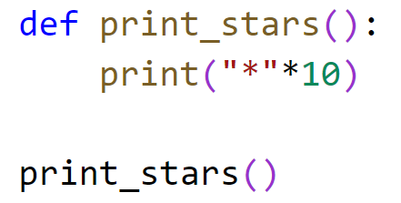
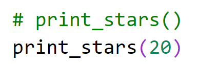
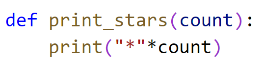
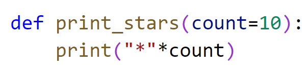
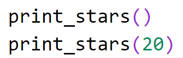
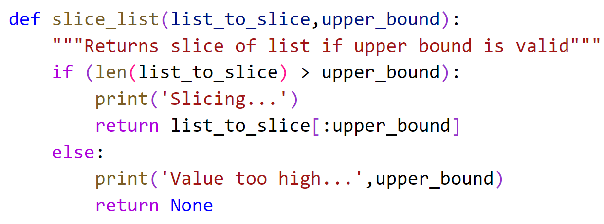
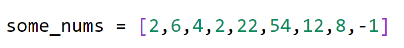
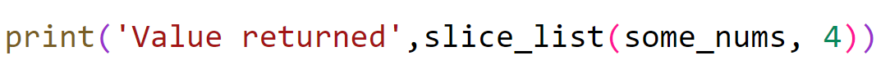
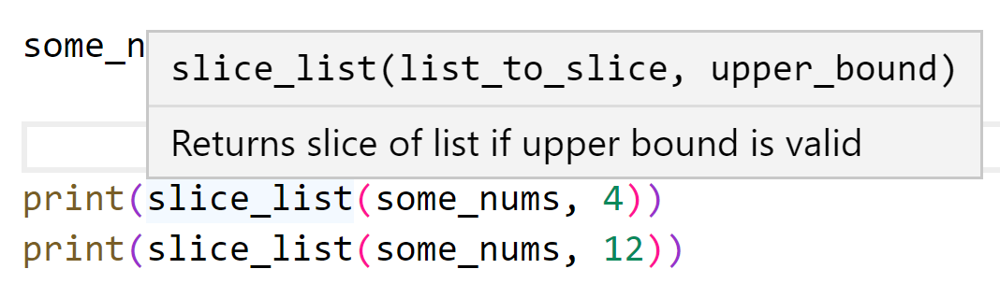
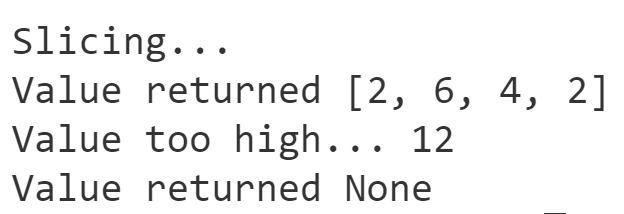

# Chapter 6: Lab 1 Functions

## Objectives

* Practice using functions that take parameters and return values

### Part 1 - Create a functions that performs work

    You will create a function that prints information. At first with no parameters, then a parameter, then optional parameter.

1. Create a new folder in your MyPython project folder called Ch06-functions. You can do this by right-clicking on the folder and choosing new folder.

2. In your MyPython project folder, in the new folder, create a new file called **functions.py** by right clicking the folder and choosing new file.
   
3. Define a function called print_stars which takes no input parameters and prints the * character 10 times. Then call the function.

    

4. Run your code, it should work.
   
5. Try to remove the () from line 1, and see if your code will work. What error does VS Code give? Even if you are not taking in parameters you need the parenthesis. Fix your code so that it runs again.
   
6. Comment out your call to print_stars and create a new call that passes 20. 

    

7. Try to run your code. What does the error in the terminal state?
   
8. Change print_stars so that it takes a number.

    

9. Run your code, it should now work again.

10. Now, change your function to have an optional value set if nothing is passed.

    

10. Now, uncomment your first call to the function - both of your calls to the function should now work. Test for errors.

    

### Part 2 - Create a slice function that returns data

    You will now create a function which returns data.

1.  Continue working in the same file. 
   
2.  At the bottom of the file. define a function called slice_list that takes in a list and a int value. 

    In the function, use a slice operation to start at the beginning of the list and get items up to the int value. 

    

3.  Now create a list of numbers with 9 items. 

    

4.  Create a statement to call the function, from within a print() to see the results. Pass in the list and the number needed by the function. 

    
   
5.  Hover over the name of the function where you are calling it in VSCode. Notice the use of the docstring by VSCode.
   
    

6.  Execute the code and note the results.
   
7.  Now repeat the function call and this time pass in 20. Run your code and note the results.

    

## Bonus

### Part 1 - Print movie info

1. Create a new file called movie_info.py
2. Define a function print_movie_info which  takes in a name and a year.
3. Inside the function print a message by using an fstring similar to this: f'The movie {movie} is from {year}
4. After the function definition
   1. create a string with the name of your favorite movie.
   2. Create a number year for the movie. 
5. Now call your print_movie_info function passing the data. 
6. Run your code - does it work? If not fix it.
   

### Part 2 - Return movie info

1. Now define a function movie_info which returns the formatted message. This function needs a return statement with the string you create.
   
2. Call the function from within print() and see if it works. If not fix it.

### Part 3 - Call function from within a loop

    Similar to part 1, define a list of dictionaries with keys of movie_name, and year. Use a for loop over the list calling your print_movie_info

1.  Keep working in movie_info.py.
   
2.  Define 3 dictionary objects in a list.
    1.  You can do this in one shot, or 
    2.  create three dictionary variables and use that to create the list.
   
3.  Loop over the list and for each item pass the movie and year to your function . 
    1.  You can do this in one statement, or break down the steps:
        1. store the current dictionary in a variable
        2. set movie to the value from the dictionary 
        3. set the year to the value from the dictionary
        4. Use your variables to call the function
   
1. Test our code to be sure it works