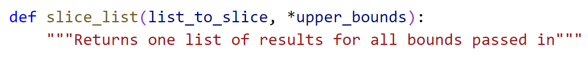
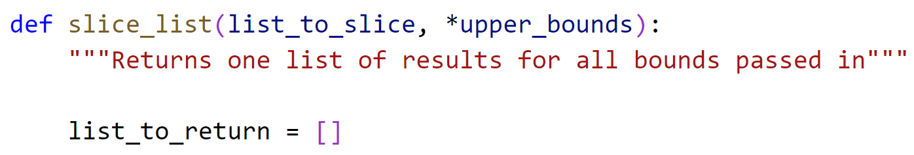
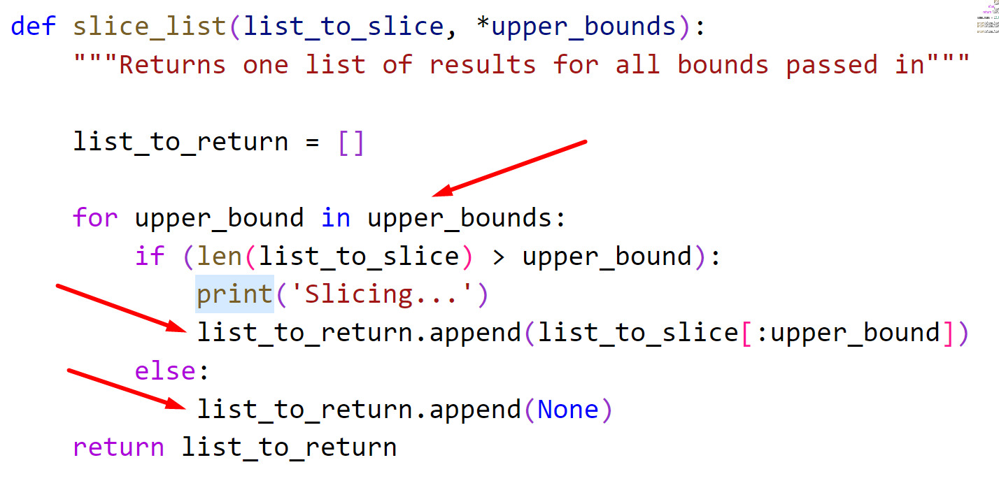
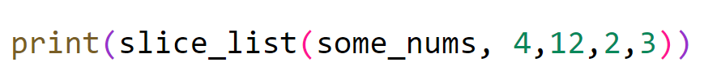

# Chapter 6: Lab 2 Variable arguments

## Objectives

* Practice using variable arguments in Python

## Steps

1. Continue working in your Ch06 folder.

2. If you fished the last exercise, skip to the next step. If you did not finish the last exercise, copy the solution from its solutions folder into your Ch06 folder. 
   
3. Create a new file by copying and pasting **functions.py** and renaming the new file to **vargs.py**
    
    (Clicking the file in the Explorer Pane, and hitting Control+C and then Control+V. Right click to rename the newly created file)

4. At the top of the new file,change the function definition from having upper_bound to *upper_bounds. Also change the description.
   
    

5. After the docstring create a new empty list.

    

6. Surround your previous logic with a for loop based on the upper_bounds variable that is received as a list. Instead of returning data now append the result to the list_to_return. After the for loop return the list_to_return.

    

7. Check that your previous calls to the function still work. 

8. Add another call passing various bounds.

    

9.  Execute the code and note the results.

## Bonus

### Create function that adds different amounts of numbers

1. Create a file in your Ch06 directory called add_numbers.py. 
   
2. Create a function called add_numbers that uses the *notation to take in various amounts of arguments. 
   
3. Use a similar approach to the exercise:
   * set a variable to hold on to the sum
   * loop over the received list adding each value to sum 
   * after the for loop return the sum
  
1. Test your code by calling it with different amounts of arguments for numbers.