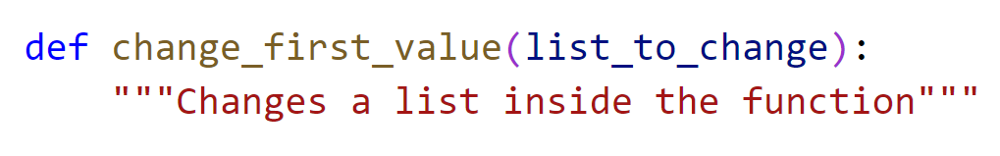
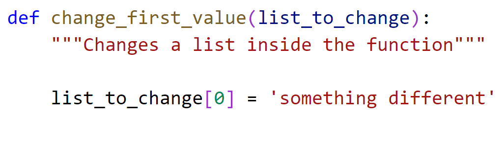
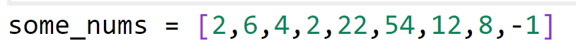
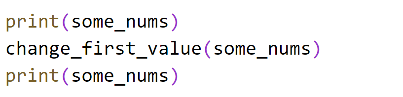
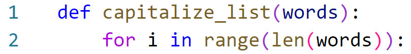

# Chapter 6: Lab 3 Passing by reference

## Objectives

* Practice using variable arguments in Python

## Steps

1. Continue working in your Ch06 folder. 
   
2. Create a new file called  **pass-by-reference.py** 
    
    (Clicking the file in the Explorer Pane, and hitting Control+C and then Control+V. Right click to rename the newly created file)

3. At the top of the new file,create a function definition called change_first_value that takes in list_to_change

    

4. After the docstring change the first value of the list that is passed in to 'something different'

    

5. After the function create an array of nums

    

6. Test your function by:
   1. Print the some_nums list.
   2. Call the function passing the list.
   1. Print the some_nums list again.

    

7.  Execute the code and note the results. The function has been able to change the data in the list.

## Bonus

### Create a function that converts a list to be capitalized

1. Create a file in your Ch06 directory called capitalize_list.py. 

    Note you cannot use capitalize or you would affect the use of the built-in
   
2. Create a function called capitalize_list that takes in an argument words
   
3.  In the function create a for loop that uses len(words)

    

1. Inside the for loop, use the i as the index for the words list to set the current value to itself, but capitalized using the capitalize() method.
   
1. still in the for loop, print the results.
   
2. Now after the function definition, create a list called fruits with lowercase values. 
   
3. Print current fruits.
4. Pass fruits into your new function.
5. Print fruits again.
   
6. You should see the data has changed.