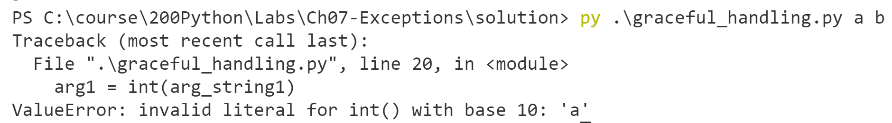
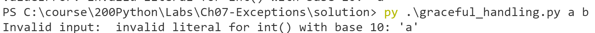

# Chapter 7: Exceptions

## Objectives

* Handle exceptions gracefully

### Overview

* You will create a program that given two numbers will add them and display the result. Your code will display a helpful message if given bad input.
   
## Steps

1. Create a new folder in your MyPython project folder called Ch06-exceptions. You can do this by right-clicking on the folder and choosing new folder.

2. In your MyPython project folder, in the new folder, create a new file called **graceful_handling.py** by right clicking the folder and choosing new file.
   
3. We need to use the sys module to ask for command line arguments. What is needed to do this?
   
4. Import the sys module and set the first two arguments to arg_string1 and arg_string2.

    

1. Open the terminal window so that you can explicitly execute the code from the prompt. 
   
1. Run your code, passing 2 and 3.  It should work - we are only setting values nothing exciting - but no errors.

    

2. Run your code again, but do not not pass values. What error do you see in the terminal? 

    

3.  Let's modify our code to guard against this IndexError and give the user a better error message. 

    Wrap these lines with a try / except, specifying IndexError. If there is an error give the user a message and exit with status of -1. 

    
    
   
4. Run your code again: 
   * passing 2 and 3 should work
   * not passing values should give a message an exit gracefully

5. Now try to convert these strings to numbers and sum them, displaying the sum.

 
   

1. Run your code again: 
   * passing 2 and 3 gives 5
   * passing a and b gives an error - what is the error?

    

3.  Let's modify our code to guard against this ValueError:
    * Wrap only the lines with int() as calculating the total would not cause the error. 
    * Use the specific exception type.
    * This time use as message to be able to include the error message.

    

4. Run your code again:
   * passing 2 and 3 should work
   * passing values a and b should give a message and exit gracefully

    

## Bonus

1. Use VS Code to search your MyPythonCourse for code you have written that uses input() or sys.argv[]
2. Can you find an example where the code breaks giving bad input? 
3. Get your program to crash with bad input. And see the error type.
4. Now wrap the offensive code in try catch and handle it more gracefully.
5. Work on other examples while others are finishing.