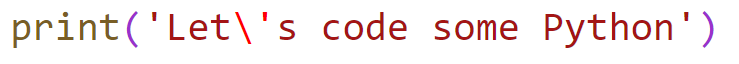
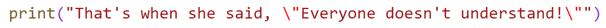
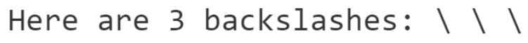
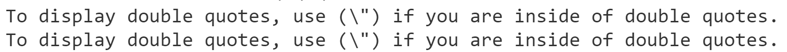
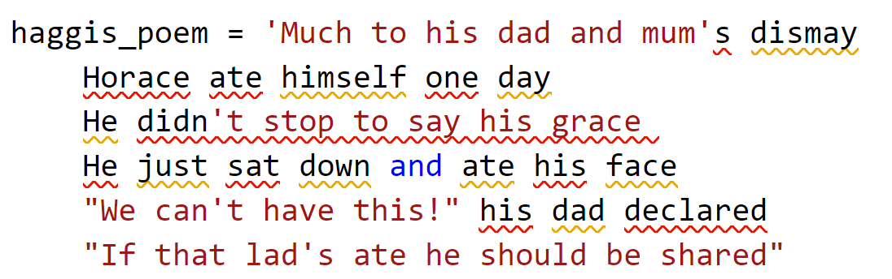
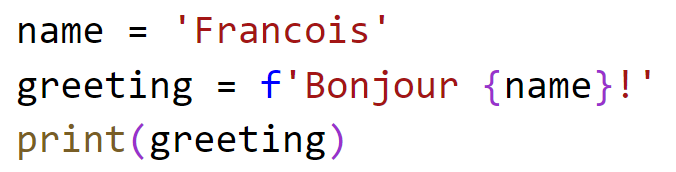
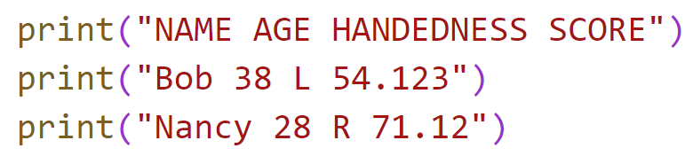
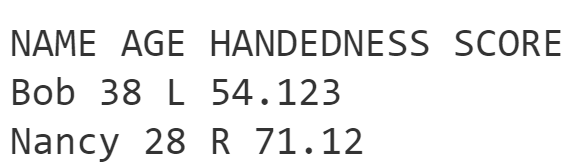

# Chapter 3: Lab 3 Practice with Strings


## Objectives
* Practice with strings
* Escape strings
* Formatted string literals
* BONUS: Using Tabs
  
  
## Steps

### Part 1: Escape Sequences

1. In your MyPythonCourse project, in the Ch03 directory create a new file called **string_practice.py**

2. To display ",', \, and other characters you need to escape the characters by putting a \ in front of them.

3. Inside your file add this statement and then run your code.
   
    

4. Copy this line of code (highlight control c) to the next line (control v) and change it to use double quotes and remove the backslash.

5. Next, add this print statement and run the code.

    

    Notice the single quote in that's does not need to be escaped because double quotes are surrounding the content. 

    The backslash helps to display "

6. To show a single \ you need to use two backslashes `\\` 

    Write a print statement to match the following output. (do three sets of escapes) 


     

7. What if you want to display the backslash and double quote as shown below? Do this twice, once with surrounded single quotes, and again with surrounding double quotes. Escape appropriately.
    

### Part 2:  Using Triple Quotes

    If you wish to preserve line breaks, use triple quotes.

1. The following is a Monty Python poem. It contains both single and double quotes. 
   
    ```
    Much to his dad and mum's dismay 
    Horace ate himself one day 
    He didn't stop to say his grace 
    He just sat down and ate his face 
    "We can't have this!" his dad declared 
    "If that lad's ate he should be shared" 
    But even as he spoke they saw 
    Horace eating more and more: 
    First his legs and then his thighs, 
    His arms, his nose, his hair, his eyes 
    "Stop him someone!" Mother cried 
    "Those eyeballs would be better fried!" 
    But all too late for they were gone, 
    And he had started on his dong... 
    "Oh foolish child!" the father mourned 
    "You could have deep-fried those with prawns, 
    Some parsely and some tartar sauce..." 
    But H was on his second course; 
    His liver and his lights and lung, 
    His ears, his neck, his chin, his tongue 
    "To think I raised himn from the cot 
    And now he's gone to scoff the lot!" 
    His mother cried what shall we do? 
    What's left won't even make a stew..." 
    And as she wept her son was seen 
    To eat his head his heart his spleen 
    And there he lay, a boy no more 
    Just a stomach on the floor... 
    None the less since it was his 
    They ate it - and that's what haggis is 
    ```

2. In your strings.py file, type haggis_poem = ''
3. Then use the Python200 project README form VS Code to copy and paste the poem in between the single quotes. NOTE: VS Code will give you errors!

  


1. Fix the issue by changing the surrounding single quotes into triple single quotes. You will have to do this to the front and back of the string before the errors go away.
   
2. Print the variable and notice the output. Notice the newline / line-break characters are preserved.

### Part 3: More Escapes

1. Navigate to \Demos\Ch03-syntax\3strings\strings.py

2. View this code and then execute it using right click and **Run Python in Terminal** option. If you have audio you will hear something. 

3. Now highlight one section at a time by highlighting code and hitting control + shift. .Make sure the code and output make sense to you.
   
###  Part 4: Formatted string literals

1. String interpolation is used to replace fields with data. Create an f-string by declaring greeting with a placeholder for name. Print the greeting and view the results. You should see **Bonjour Francois!**

  


2. Mark your work as complete before starting exercise.
   
## Bonus

### Format data using tabs 
1. Print the following sample data.

  

2. Run your code and it will look like this. 
  

3. Now copy and paste the prints you just created, and in the new copy use \t to create tabs to format the output to look like this. If data runs over, you may need to use two \t when necessary.

  


