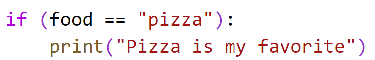
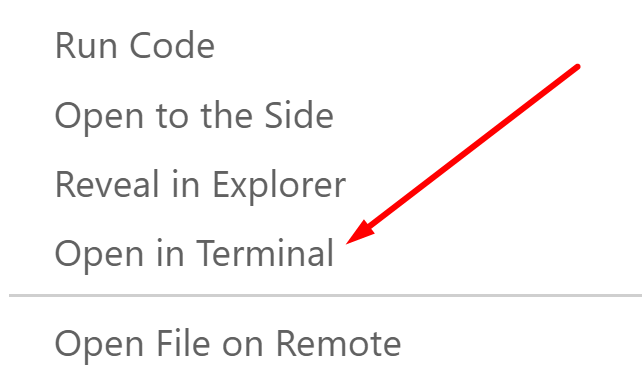
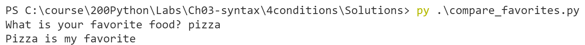
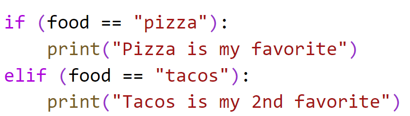
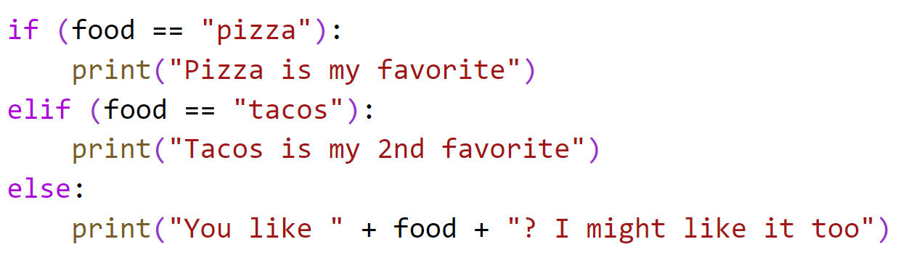
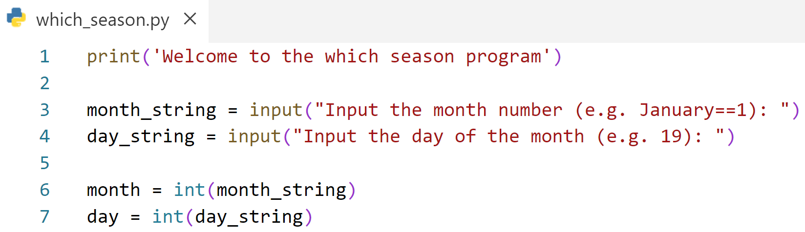
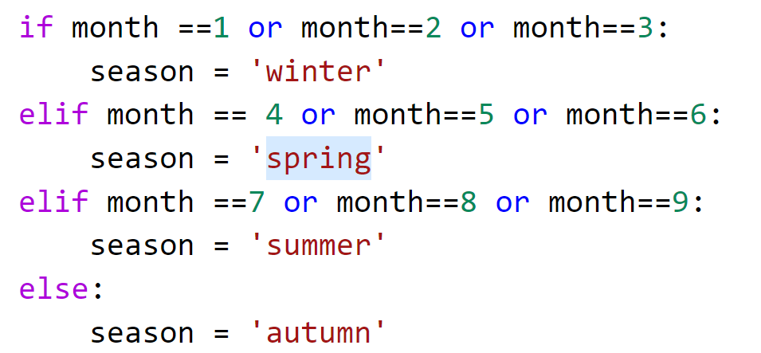
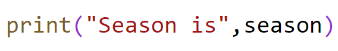
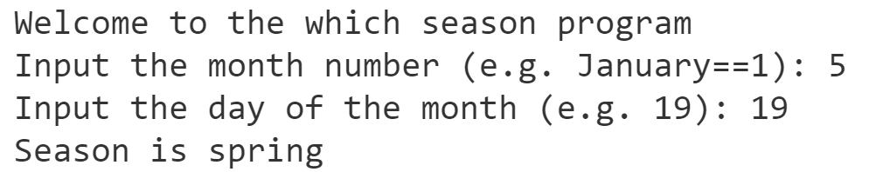
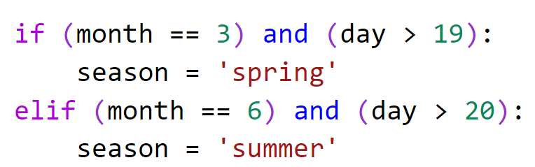

# Chapter 3: Using Conditional Statements

## Objectives
* Use conditionals to create programs with different paths of logic.

## Steps

### Part 1 Favorite Foods 

1. In your MyPythonCourse project, in the Ch03 directory create a new file called **compare_favorites.py**
   
2. Inside this new file, add the following line which uses the input function to read in a string that represents a favorite food.

    ```python
    food = input("What is your favorite food? ")
    ```

3. Use an if statement, if pizza was entered print pizza is my favorite.

    


4. You can run the program now by right-clicking in the Explorer pane and choosing open in terminal.

    


5. Recall that you start the program using py and the name of the file: **py  compare_favorites.py**
   
6.  If you enter pizza it should print the message. If you dont enter pizza it should just end. 

    


   
7. Now, use an elif to check if the food is tacos, and print tacos are my 2nd favorite.
    

8. Return to the terminal window, and re-run the program again by clicking the up arrow. Now try with tacos and try with pizza. You should get the pizza message for pizza, and the tacos message for tacos. Anything else, and the program just ends, silently.

9.  Now add an else section to your code to print a message if anythign else is entered.
    

1. Return to the terminal, hit the up arrow and run the program again. Test all 3 cases and make sure code is working correctly.

### Part 2 What is the season?

    Here we will ask the user for the month and day. We will then tell them whcih season it is. Because some months have more than one season we need to use the day for those months.

1. In your MyPythonCourse project, in the Ch03 directory create a new file called **which_season.py**
   
2. Inside this new file, add the following lines which:
   * use the input function to read in a numeric value for a month and day
   * convert the numbers to strings

    

 
3. Use conditions to assign a season for the month given.  
    

1. Add in a print statement now to print the season.
    

2. Now execute your program form the terminal. Refer to previous exercises if you need help with this step. For the data use the month of 5. The results should say Season is Spring.

    


   
3. If you run the program again with month of 12 and day of 31, the result will not be winter. Let's fix this in the following steps.
   
4. Before the print statement, add in checks for certain months and the days. The following checks if the month is 3 AND the day is greater than 19 (first day of Spring), elsif it checks for summer.
    

5. Now add the rest of the logic in two more elif statements. 
   * If the month is September and the day > 21 set season to autumn. 
   * If the month is December and the day > 20 set season to winter.

  1. Now run your program. With month of 12 and day of 31, the result will be winter. 


### Bonus

1. Modify compare_favorites.py and ask the user for their favorite month. Use an if, two elif, and an else to compare against your favorite months printing an appropriate message.


