# Chapter 3: Lab 6 Practice with String Methods

## Objectives

* Practice with different string methods
* Manipulate string data into a new string
* get information about strings
* format strings for printing

## Overview

* Write a program that uses the name of the program as a source string and does various work with that string.

1. In your MyPython project folder, in the folder Ch03, create a new file called **display_movie_info.py**.
   
2. We will be getting the name of the program. Do you remember which standard library module can give us this information?

    We use **sys** for this, so import sys at the top of your file. 
   
3. Create a variable called **program_name** and set its value equal to **sys.argv[0]**. This gets the name of the file.
   
4. Print the name of the file using tabs to make the output readable.

    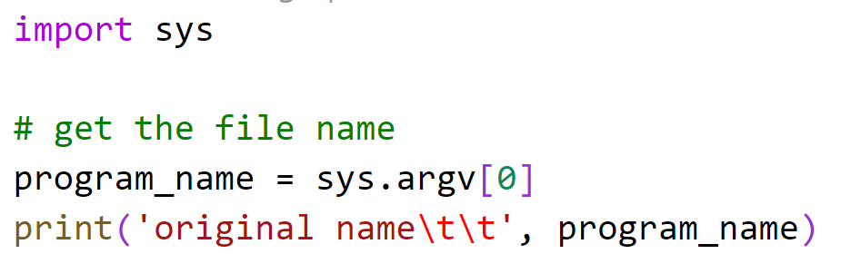

5. Run your program BY USING THE VSCODE TERMINAL WINDOW, not the shortcut. You must do this to get the right information. When you run the program you should see the name of the file.
    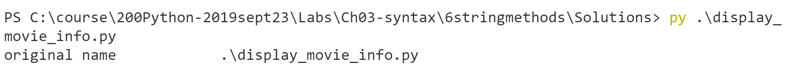
    
6. Now convert the program name to uppercase using the upper function. Do this in one line also printing it. Then print the original name again. 

    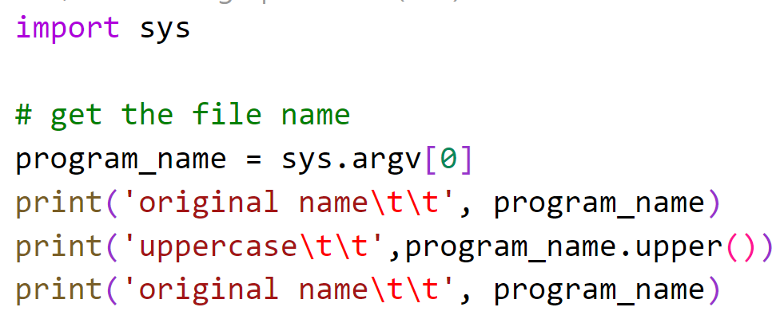

    ----

    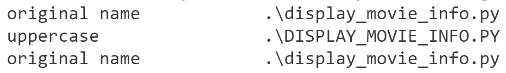

 
7. Notice that by using **upper()** we did not modify the original string. Strings are immutable. If you wish to update the value you must perform work, and reassign the result back to the original variable.

8. Replace the underscores in the movie name with spaces by using the **replace()** function. The first argument is what to look for in the string, the 2nd argument is what to replace it with.  

    Store the result back into the **program_name** variable. Print the new value using the same type of notation as before - a string to indicate what you have done, with tabs, and the variable.

    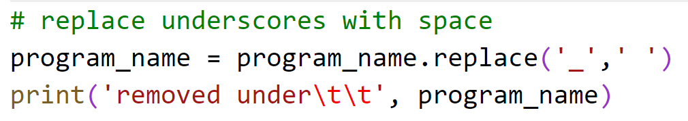

    You should see the output now without underscores.
    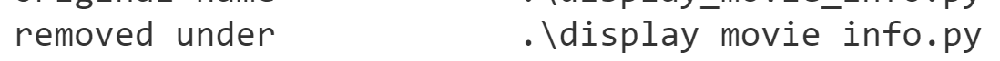

9.  Depending on how you ran your program, you may have .\ in front of the filename. You can use replace to replace with empty string as well. Be sure to escape the \ character. Run your code to check your work.

    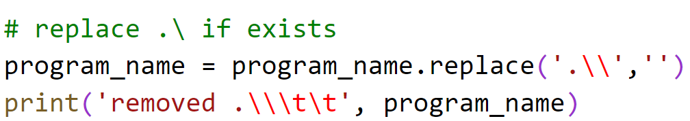

10. Now replace the extension of .py so that it no longer shows. Run your code to check your work.

    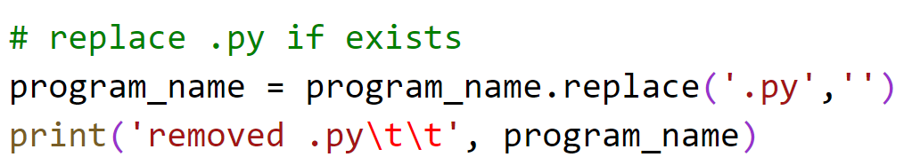

11. Now convert the name to upper case and print the result. Run your code to check your work.

    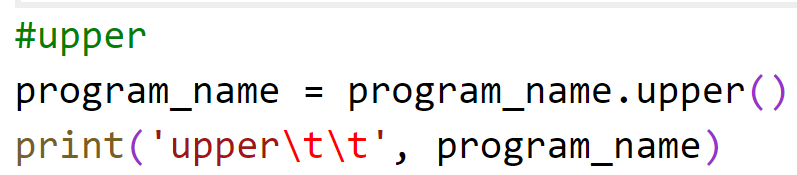

12. Now create a string called **welcome_message** and give it text with the ability to have information substituted between curly braces. Then call **format()** passing the **program_name**. Print the welcome message.

    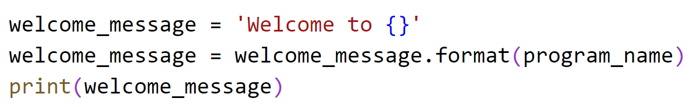

13. Lets make the welcome message more eye catching by surrounding it with stars and centering it..  You can do this using **center()** and passing arguments to set the width to be 3 times the length of the string.

    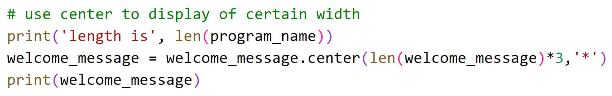

    ---
    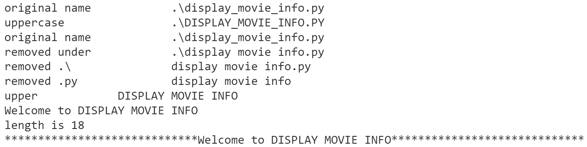

14. Now let's ask the user for a numeric value. The **str.isdecimal()** returns True if the string can be converted to a numeric value. Use a while loop to keep looping until good input is given. Use the following image as a guide.

    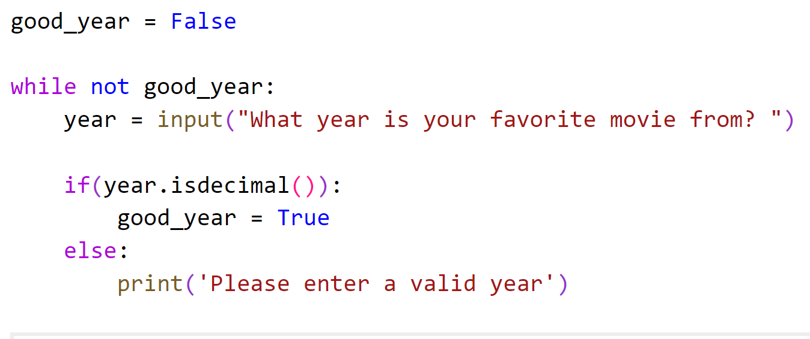

15. Now use the **str.format()** function to display a message to the user. Note its use of curly braces.

    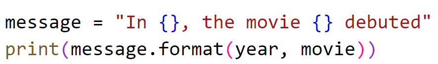

16. Run your program. Given good data it should look nice. Fix any errors.

    

   
17. Run your program again, and this time for the movie enter many spaces in front of the name like this:

    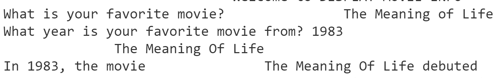

1. Above the message creation and print, change movie to have any left spaces stripped out. 

    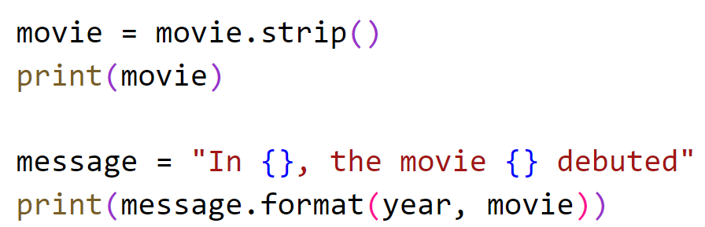

1. If you run the code, and give leading spaces, they will be stripped out.
