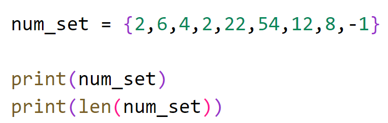
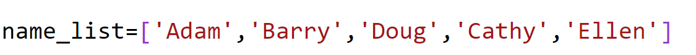
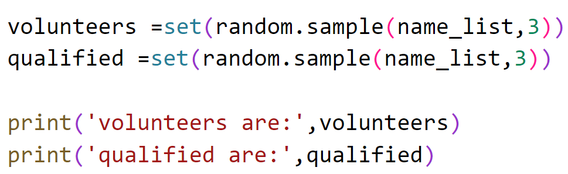
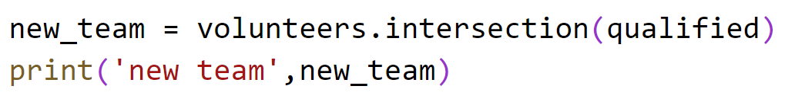
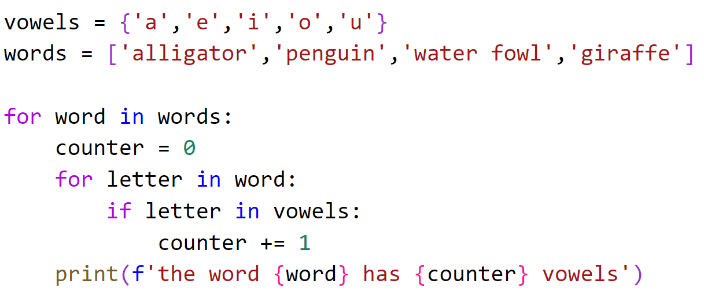

# Chapter 4: Lab 2 Sets

## Objectives

* Practice using Sets

## Overview:

You will create and work with different sets.

## Steps

### View Unique Values in a set
1. In your MyPython project folder, in the folder Ch04, create a new file called **set_practice.py**. You can do this by right clicking the folder and choosing new file.
   
1. In the created file, create a set of numbers with 9 items. Have 2 in the set twice. Do not have any other repeated values. Then print num_set. Run your code. 

    

1. Run your code and not the returned value should be 8.

### View Unique Values in a set

    Here you will write code that helps you to create a new team of people that have volunteered and are qualified.

1. Create a list of 5 names.
   
    

2. We will use random to sample this list, so add **import random** to the top of your file.
   
3. Use **random.sample()** twice, on the **name_list**, picking 3 people. First asisgn names to the volunteers set and then to a qualified set. The set function is used to convert from list to set. Print the values.

    

4. Run the code twice to see the randomness of the sets.
   
5. To find out who is BOTH volunteering AND qualified, you can use the **intersection** function. Create a new set called new_team and get the intersection of volunteers and qualified people.

    

## Bonus

### Check how many vowels are in a word
1. Create a set called vowels with a,e,i,o,u

2. Create a list of words: ['alligator','penguin','water fowl','giraffe']
   
3. Output the word and the number of vowels it has.
   
   
4. PSEUDOCODE. If you need more guidance, scroll down. 
   1. Loop through the list using for word in words 
   2. For each word:
    * start a counter at 0
    * loop through the letters, for letter in word
    * if letter in vowels
      * increment count
    * at end of word, print the word and the number of vowels

    For a Hint on how to do this...scroll down...

    ```


    ```

    

