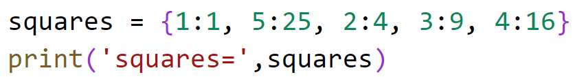
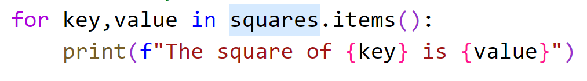
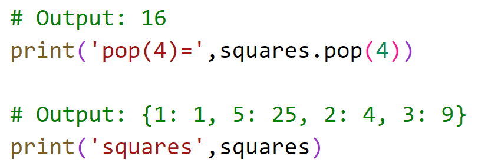
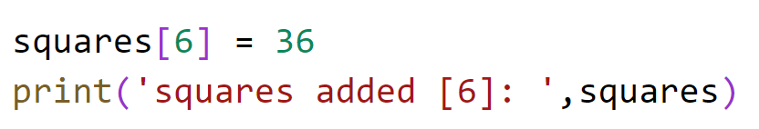
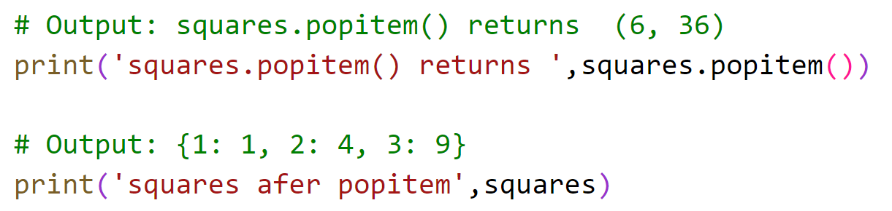
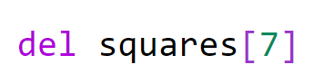
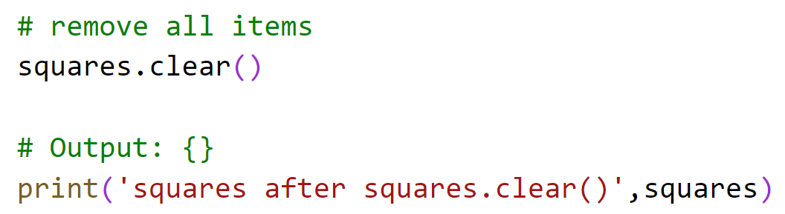
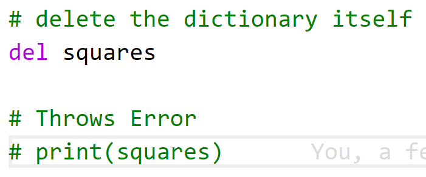

# Chapter 4: Lab 3 Dictionary

## Objectives

* Practice using Dictionary

## Overview:

You will create and work with dictionary.

## Steps

### View Unique Values in a set

1. In your MyPython project folder, in the folder Ch04, create a new file called **dictionary_practice.py**. 

2. In the created file, create this dictionary and then print it. Run your code to see the output.
   
    

3. Continue with the following steps running your code to see the output.
   

4. Get all keys and values by calling items(). Use a for loop to display the data. 
   
    

5. You can remove an item using pop() by passing it the key of the item to remove. 
   
    

6. Add a new square using square brackets and the assignment operator.

    

7. If you use popitem() it removes the last added item. Do this now and print the output.

    

8. Delete an item using bracket notation. 

    

9.  Delete an item using bracket notation but give an invalid value. Try to run the program and view the error message. Then comment out this new del.

    

10. Remove all items in dictionary by using clear()

       

11. Remove the entire dictionary using del. Try to print and see the error. Then comment out the print.

        

## Bonus

1. Use code to generate a dictionary that has the keys 1 to 10 - and their values are 3 times the amount of the key.

    Use a for loop with items() to get the keys and values. Print am understandable display of the data.

