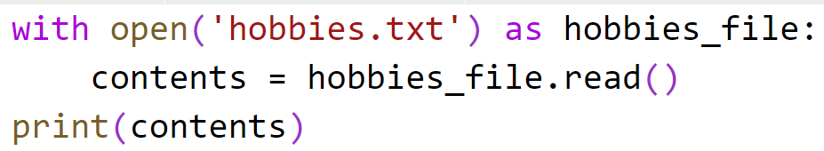

# Chapter 8: Reading Files

## Objectives

* Read from a file

  You will create a file of your hobbies and then print it to the screen.

1. Create a new folder in your MyPython project folder called Ch08-files. You can do this by right-clicking on the folder and choosing new folder.

2. In your new folder, create a new file called **hobbies.txt** by right clicking the folder and choosing new file.
   
3. Inside of hobbies create 4 lines, put one of your hobbies on each line.

4. In your new folder, create a new file called **reading.py** by right clicking the folder and choosing new file.
   
5. Add code that opens your new file and prints it to the screen.

    

### BONUS

#### Read in friends

   Follow the same process as in the exercise as you consider how to do the next steps.

1. Create a file of your friends.
2. Read in the contents as you just did in the exercise and put the strings into a list. 
3. Loop and print.
4. Now comment out a friend by adding a #
5. Use the string function startswith function to not add the commented out friends to the list.