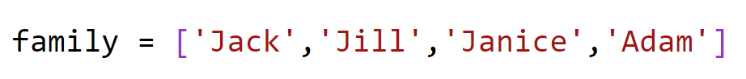
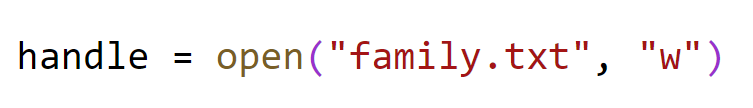
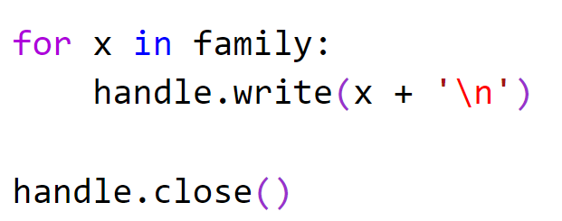
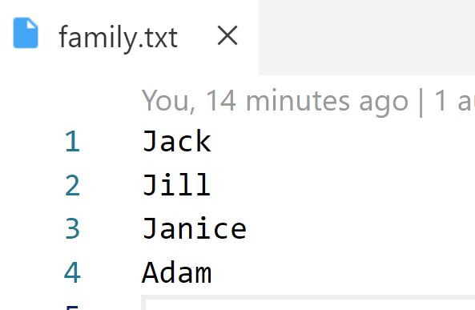

# Chapter 8: Writing Files

## Objectives

* Create a program that defines a list and then write out the elements one line at a time to a file

1. In your Ch08-files folder, create a new file 
 **writing.py**

2. In the file create a list called family with four strings representing people's names. 
   
    

1. Use hand to open the file for writing by passing a second argument of w.

    

   
1. Create a for in that will iterate over each element in the list. Each time through the loop, write out the current element. Use \n in order to add a line break. After the for loop close the file.

    

1. Open a terminal and manualy start the program using py writing.py

1. Test that you have a file created in this same directory that contains all four names.

    

## Bonus

1. Create a list of dictionaries with keys for name, email, and employee_id

2. Create a CSV file by:
   *  looping over the list
      *  for each item print name, emil, by adding a comma betw