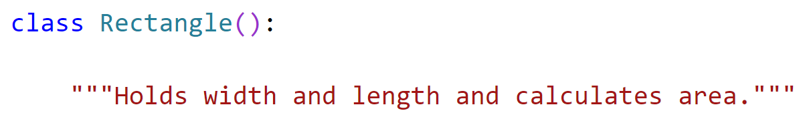
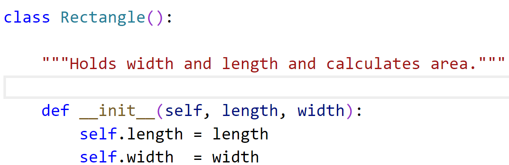
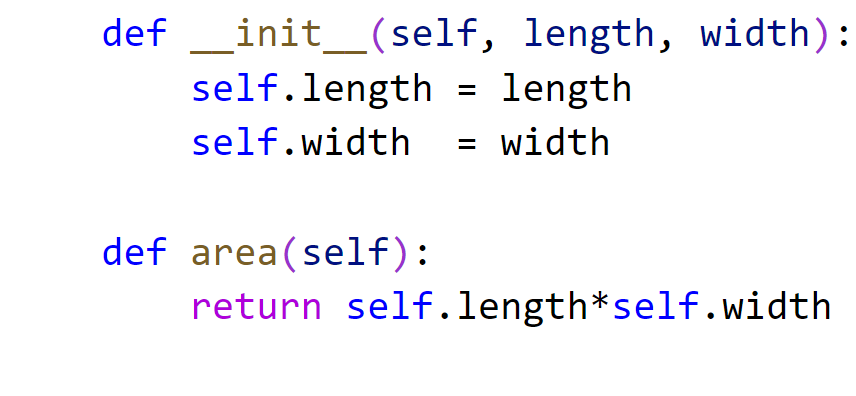
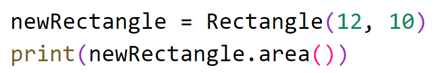
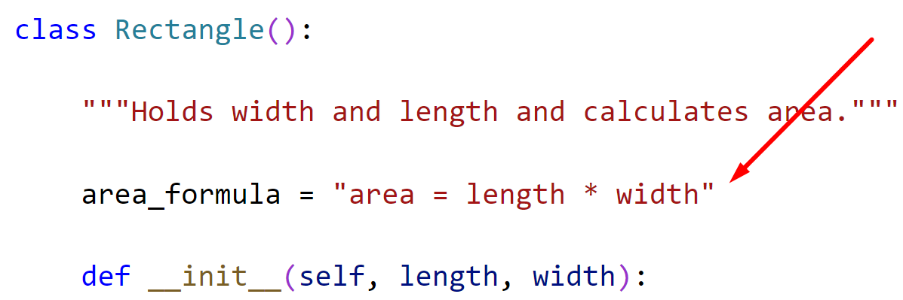
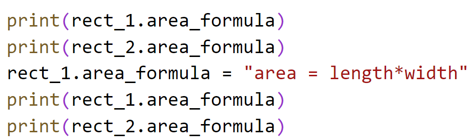
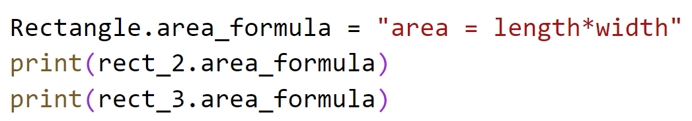
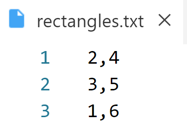

# Chapter 9: Lab 1 Create class

## Objectives

* Define a class with methods
* Create an instance of the class
* call methods on the created object

## Overview

* You will create a Rectangle class that has a method to calculate its area. You will then create multiple 
rectangles.

1. Create a new folder in your MyPython project folder called Ch09-classes. Do all of your work for this chapter in there.
   
2. In your MyPython project folder, in the new folder, create a new file called **rectangle.py** by right clicking the folder and choosing new file.
   
   
3. Define a class Rectangle and on the next line indent for the class contents and create a docstring. 
   
    

4. At the same indentation as the docstring define the __init__ method.  Be sure to use two underscores.

    The first argument should always be self. Here we also want the length and width.
   
    

5. At the same indentation as the  __init__ method define an area method. 
   
    Again, the first argument should always be self. Here it is the only argument.
   
    

1. That is the end of our class definition. So now at create an instance of Rectangle, and then call the area function inside of print. 

    

1. Test that your code works and fix any syntax errors.
   
2. Now, create a class variable called area_formula. Class variables go at the top of the class and will be shared between instances.
   
    

1. Now at the bottom of your file after your previous code, add in code to print and try to change the formula to not have spaces between operands using an instance.

    

1. Run your code. What is the formula for the two rectangles?
   
2. You should see that rect1 has changed but not 2. Class variables should only be changed using the class.

3. Add in this code to change the class variable using Rectangle, and test that it affects the instances. 

    

## Bonus

### Part 1 - Create a new class called Circle and provide an area function.

1. Create a file circle.py
2. Inside the file create a class called Circle - just like you did for Rectangle, but you only need to store the radius. 
3. The area formula is 2 * math.pi * radius
4. Make sure you import math

### Part 2 - use file data to create class.

1. Create a file with data for rectangles length and width.

    
   
2.  Read from the file and create a list of the data.
   
3.  Print to the screen a report similar to this:

   You have 3 rectangles.  
* Rectangle 1: area 8
* Rectangle 2: area 15
* Rectangle 3: area 6
  